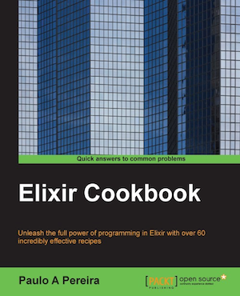

```
Roberto Nogueira  BSd EE, MSd CE
Solution Integrator Experienced - Certified by Ericsson
```

`

# Elixir Cookbook

## About

This book is a set of recipes grouped by topic that acts as a good reference to get ideas from or to quickly search for a solution to a problem. You will begin by launching an `IEx` session and using it to test some ideas. Next, you will perform various operations like loading and compiling modules, inspecting your system, generating a supervised app, and so on. Furthermore, you will be introduced to immutability, working with data structures, performing pattern matching, and using stream modules to generate infinite data sequences. You will learn about everything from joining strings to determining the word frequency in text. With respect to modules and functions, you will also discover how to load code from other modules and use guards and pattern matching in functions.

[Homepage](https://www.packtpub.com/application-development/elixir-cookbook)

## Contents

```
Table of Contents
1: COMMAND LINE
[x] Introduction
[x] Using the terminal to prototype and test ideas
[x] Loading and compiling modules
[x] Getting help and accessing documentation within IEx
[x] Using Erlang from Elixir
[x] Inspecting your system in IEx
[x] Inspecting your system with Observer
[x] Creating a simple application
[x] Managing dependencies
[x] Generating a supervised application
[x] Generating umbrella applications
[x] Managing application configuration
[x] Creating custom Mix tasks
2: DATA TYPES AND STRUCTURES
[x] Understanding immutability
[x] Adding and subtracting lists
[x] Combining tuples into a list
[x] Creating and manipulating keyword lists
[x] Using pattern matching
[x] Pattern matching an HTTPoison response
[x] Creating a key/value store with a map
[x] Mapping and reducing enumerables
[x] Generating lazy (even infinite) sequences
[x] Streaming a file as a resource
3: STRINGS AND BINARIES
[x] Introduction
[x] Joining strings
[x] Splitting strings
[x] Replacing string codepoints with patterns
[x] Slicing strings with ranges
[x] Using regular expressions
[x] Combining operations with the |> operator
[x] Creating a word list
[x] Determining the word frequency in a text
[x] Reading and writing metadata from MP3 files
4: MODULES AND FUNCTIONS
[x] Introduction
[x] Namespacing modules
[x] Using module attributes as constants
[x] Enforcing behaviors
[x] Documenting modules
[x] Using module directives
[x] Using a module in the scripted mode
[x] Defining functions with default arguments
[x] Using guard clauses and pattern matching in function definitions
5: PROCESSES AND NODES
[x] Introduction
[x] Sending messages between processes
[x] Making code run on all available CPUs
[x] Using tasks to perform multiple concurrent computations
[x] Creating a stateful server process (messages with counters)
[x] Using agents as an abstraction around states
[x] Using an ETS table to share the state
[x] Creating named nodes
[x] Connecting nodes
[x] Executing code in a different node
6: OTP – OPEN TELECOM PLATFORM
[ ] Introduction
[ ] Implementing a GenServer
[ ] Expanding our server
[ ] Creating a supervisor
[ ] Using Observer to inspect supervisors and processes
[ ] Handling errors and managing exceptions
[ ] Packaging and releasing an OTP application
[ ] Deploying applications and updating a running system
7: COWBOY AND PHOENIX
[ ] Introduction
[ ] Setting up Cowboy
[ ] Serving static files
[ ] Implementing a websocket handler
[ ] Creating a Phoenix application
[ ] Defining routes
[ ] Creating a controller
[ ] Creating views and templates
[ ] Implementing topics
[ ] Protecting the Phoenix app with SSL
8: INTERACTIONS
[ ] Introduction
[ ] Using Redis and Postgres
[ ] Using OS commands from within Elixir
[ ] Getting Twitter data
[ ] What You Will Learn
[ ] Utilize Erlang code seamlessly from Elixir, leveraging a huge amount of battle-tested libraries
[ ] Use the Mix tool to generate applications and manage dependencies
[ ] Create modules and functions and use them from different machines, taking advantage of Elixir's integrated distribution mechanism
[ ] Implement OTP behaviors in Elixir
[ ] Package and deploy applications on running systems
[ ] Work with the Phoenix framework to generate a basic web application
[ ] Interact with external programs and APIs
[ ] Serve static files and implement websockets
```
