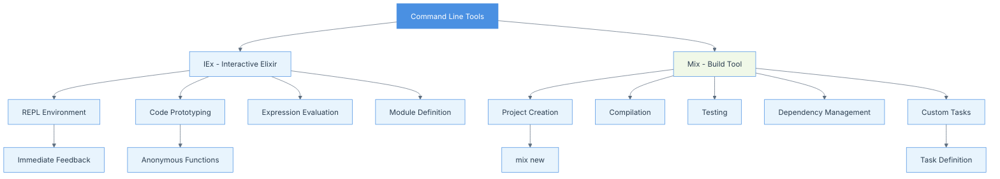

# Chapter 01: Command Line

## Summary

Chapter 1 introduces the command-line tools essential for Elixir development. It covers Interactive Elixir (IEx), the REPL environment for immediate code evaluation and prototyping, and Mix, the build tool for creating, compiling, and managing Elixir projects. The chapter demonstrates how to use IEx for testing ideas, defining modules and functions interactively, and leveraging Mix for project scaffolding and custom task creation. These command-line tools form the foundation of the Elixir development workflow, enabling developers to efficiently prototype, test, and build applications.

## Concepts Map



## Key Concepts

- **IEx (Interactive Elixir)**: A REPL environment for immediate code evaluation and experimentation without compilation
- **REPL**: Read-Eval-Print Loop that allows interactive programming and testing
- **Mix**: Elixir's build tool for project creation, compilation, testing, and dependency management
- **Expression Evaluation**: Immediate execution and result display of Elixir code in IEx
- **Anonymous Functions**: Functions defined inline without names using `fn` syntax
- **Module Definition**: Creating modules interactively in IEx without saving to files
- **Project Scaffolding**: Using Mix to generate project structure and boilerplate code
- **Custom Mix Tasks**: Defining project-specific commands using Mix's task framework
- **Dependency Management**: Handling external libraries and packages through Mix
- **Command-Line Interface**: Text-based interface for interacting with Elixir tools and applications

## Quiz (20260204_120000)

1. What is IEx in Elixir?
   - [ ] A. An Integrated Development Environment
   - [x] B. Interactive Elixir - a REPL environment
   - [ ] C. A debugging tool
   - [ ] D. A web framework

2. How do you start IEx from the command line?
   - [ ] A. `elixir start`
   - [x] B. `iex`
   - [ ] C. `mix iex`
   - [ ] D. `elixir -i`

3. What does REPL stand for?
   - [ ] A. Real Execution Program Loop
   - [x] B. Read-Eval-Print Loop
   - [ ] C. Runtime Evaluation Programming Language
   - [ ] D. Recursive Expression Processing Logic

4. What is Mix primarily used for?
   - [ ] A. Mixing different programming languages
   - [x] B. Project creation, compilation, and management
   - [ ] C. Database migrations only
   - [ ] D. Web server configuration

5. How do you define an anonymous function in Elixir?
   - [ ] A. `function(a, b) -> a + b end`
   - [x] B. `fn(a, b) -> a + b end`
   - [ ] C. `lambda a, b: a + b`
   - [ ] D. `def anonymous(a, b), do: a + b`

6. How do you exit IEx?
   - [ ] A. Type `exit`
   - [ ] B. Press Ctrl + D
   - [x] C. Press Ctrl + C twice
   - [ ] D. Type `quit()`

7. What command creates a new Mix project?
   - [ ] A. `mix create project_name`
   - [x] B. `mix new project_name`
   - [ ] C. `elixir new project_name`
   - [ ] D. `mix init project_name`

8. Can you define entire modules directly in IEx?
   - [x] A. Yes, without saving to files
   - [ ] B. No, modules must be in files
   - [ ] C. Only simple modules
   - [ ] D. Only with special flags

9. What is a custom Mix task?
   - [ ] A. A built-in Mix command
   - [x] B. A user-defined command specific to a project
   - [ ] C. A task that runs automatically
   - [ ] D. A system-level command

10. What advantage does IEx provide over editing and compiling files?
    - [ ] A. Better performance
    - [ ] B. More features
    - [x] C. Immediate feedback without compilation overhead
    - [ ] D. Automatic code completion

### Answers
1. B, 2. B, 3. B, 4. B, 5. B, 6. C, 7. B, 8. A, 9. B, 10. C

## Challenge

**Task**: Create a custom Mix task that displays information about your Elixir installation and system.

Create a Mix task called `mix info` that when executed, displays:
1. The Elixir version
2. The Erlang/OTP version
3. The current working directory
4. A list of all Mix tasks available

**Hint**: Mix tasks are defined in the `lib/mix/tasks/` directory and use the `Mix.Task` behavior.

### Answer

1. Create a new Mix project:
```bash
mix new system_info
cd system_info
```

2. Create the file `lib/mix/tasks/info.ex`:
```elixir
defmodule Mix.Tasks.Info do
  use Mix.Task

  @shortdoc "Displays system and Elixir information"
  
  @moduledoc """
  Displays information about the Elixir installation and system.
  
  ## Usage
  
      mix info
  """
  
  def run(_) do
    IO.puts("\n=== System Information ===\n")
    
    # Elixir version
    IO.puts("Elixir version: #{System.version()}")
    
    # Erlang/OTP version
    otp_release = :erlang.system_info(:otp_release) |> to_string()
    IO.puts("Erlang/OTP version: #{otp_release}")
    
    # Current working directory
    cwd = File.cwd!()
    IO.puts("Current directory: #{cwd}")
    
    # Available Mix tasks
    IO.puts("\n=== Available Mix Tasks ===\n")
    Mix.Task.load_all()
    tasks = Mix.Task.all_modules()
            |> Enum.map(&Mix.Task.task_name/1)
            |> Enum.sort()
    
    Enum.each(tasks, fn task ->
      IO.puts("  - mix #{task}")
    end)
    
    IO.puts("")
  end
end
```

3. Run the task:
```bash
mix info
```

This will display comprehensive system information including Elixir and Erlang versions, the current directory, and all available Mix tasks.
