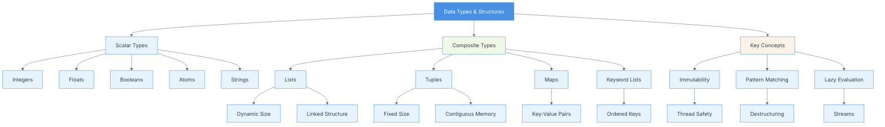

# Chapter 02: Data Type and Structures

## Summary

Chapter 2 explores Elixir's fundamental data types and structures, emphasizing key functional programming concepts like immutability, pattern matching, and lazy evaluation. The chapter covers scalar types (integers, floats, booleans, atoms, strings) and composite types (lists, tuples, maps, keyword lists). It demonstrates how immutability ensures data safety in concurrent environments, how pattern matching enables elegant code, and how lazy evaluation with streams allows efficient processing of large datasets. Understanding these concepts is crucial for writing idiomatic and efficient Elixir code.

## Concepts Map



## Key Concepts

- **Scalar Data Types**: Single-value types including integers, floats, booleans, atoms, and strings
- **Composite Data Types**: Collection types including lists, tuples, maps, and keyword lists
- **Immutability**: Data structures cannot be modified after creation, ensuring thread safety and predictable behavior
- **Pattern Matching**: Technique for destructuring and binding values based on structure and content
- **Lists**: Dynamic-sized, linked collections denoted by square brackets `[]`
- **Tuples**: Fixed-sized, contiguous memory collections denoted by curly braces `{}`
- **Maps**: Key-value data structures with unique keys denoted by `%{}`
- **Keyword Lists**: Special lists of two-element tuples often used for options
- **Atoms**: Constants whose name is their value, prefixed with `:`
- **Lazy Evaluation**: Deferred computation using streams for efficient processing of large datasets
- **First-Class Functions**: Functions can be passed as arguments, returned as values, and assigned to variables
- **Destructuring**: Extracting values from data structures through pattern matching

## Quiz (20260204_120100)

1. What characterizes scalar data types in Elixir?
   - [x] A. They represent a single value
   - [ ] B. They contain multiple values
   - [ ] C. They are always numbers
   - [ ] D. They are mutable

2. How are lists denoted in Elixir?
   - [ ] A. Curly braces `{}`
   - [x] B. Square brackets `[]`
   - [ ] C. Parentheses `()`
   - [ ] D. Angle brackets `<>`

3. What is immutability in Elixir?
   - [ ] A. Variables can be changed at any time
   - [x] B. Data structures cannot be modified after creation
   - [ ] C. Only numbers are immutable
   - [ ] D. Functions cannot be modified

4. What are atoms in Elixir?
   - [ ] A. Small particles
   - [ ] B. Variable types
   - [x] C. Constants whose name is their value
   - [ ] D. Special strings

5. How are maps denoted in Elixir?
   - [ ] A. `[]`
   - [ ] B. `{}`
   - [x] C. `%{}`
   - [ ] D. `<>`

6. What is the main difference between lists and tuples?
   - [x] A. Lists are dynamic-sized, tuples are fixed-sized
   - [ ] B. Lists store numbers, tuples store strings
   - [ ] C. Lists are immutable, tuples are mutable
   - [ ] D. There is no difference

7. What does pattern matching allow you to do?
   - [ ] A. Match strings only
   - [ ] B. Create patterns for designs
   - [x] C. Destructure and bind values based on structure
   - [ ] D. Compare two variables

8. What are keyword lists typically used for?
   - [ ] A. Storing large datasets
   - [x] B. Function options and configuration
   - [ ] C. Mathematical calculations
   - [ ] D. String manipulation

9. What is lazy evaluation in Elixir?
   - [ ] A. Slow code execution
   - [ ] B. Delayed programming
   - [x] C. Deferred computation using streams
   - [ ] D. Avoiding work

10. Why is immutability important in concurrent programming?
    - [ ] A. It makes code slower
    - [ ] B. It uses more memory
    - [x] C. It ensures thread safety and prevents race conditions
    - [ ] D. It's not important

### Answers
1. A, 2. B, 3. B, 4. C, 5. C, 6. A, 7. C, 8. B, 9. C, 10. C

## Challenge

**Task**: Create a module that demonstrates pattern matching and immutability by implementing a simple shopping cart system.

Implement a module called `ShoppingCart` with the following functions:
1. `new/0` - Creates an empty cart (returns an empty map)
2. `add_item/3` - Adds an item to the cart with name, price, and quantity
3. `remove_item/2` - Removes an item from the cart
4. `total/1` - Calculates the total price of all items
5. `update_quantity/3` - Updates the quantity of an existing item

Demonstrate that operations return new carts rather than modifying the original.

### Answer

```elixir
defmodule ShoppingCart do
  @moduledoc """
  A shopping cart implementation demonstrating immutability and pattern matching.
  """

  @doc """
  Creates a new empty shopping cart.
  """
  def new do
    %{}
  end

  @doc """
  Adds an item to the cart.
  Returns a new cart with the item added.
  """
  def add_item(cart, item_name, price, quantity) when quantity > 0 do
    Map.put(cart, item_name, %{price: price, quantity: quantity})
  end

  @doc """
  Removes an item from the cart.
  Returns a new cart without the item.
  """
  def remove_item(cart, item_name) do
    Map.delete(cart, item_name)
  end

  @doc """
  Calculates the total price of all items in the cart.
  """
  def total(cart) do
    cart
    |> Enum.reduce(0, fn {_name, %{price: price, quantity: qty}}, acc ->
      acc + (price * qty)
    end)
  end

  @doc """
  Updates the quantity of an existing item.
  Returns a new cart with updated quantity.
  """
  def update_quantity(cart, item_name, new_quantity) when new_quantity > 0 do
    case Map.get(cart, item_name) do
      nil -> cart
      item -> Map.put(cart, item_name, %{item | quantity: new_quantity})
    end
  end
  
  def update_quantity(cart, item_name, 0) do
    remove_item(cart, item_name)
  end
end

# Usage examples demonstrating immutability:
cart1 = ShoppingCart.new()
# => %{}

cart2 = ShoppingCart.add_item(cart1, "Apple", 1.50, 5)
# => %{"Apple" => %{price: 1.5, quantity: 5}}
# Note: cart1 is still %{} - immutable!

cart3 = ShoppingCart.add_item(cart2, "Banana", 0.75, 3)
# => %{"Apple" => %{price: 1.5, quantity: 5}, "Banana" => %{price: 0.75, quantity: 3}}

total = ShoppingCart.total(cart3)
# => 9.75 (5 * 1.50 + 3 * 0.75)

cart4 = ShoppingCart.update_quantity(cart3, "Apple", 10)
# => %{"Apple" => %{price: 1.5, quantity: 10}, "Banana" => %{price: 0.75, quantity: 3}}
# Note: cart3 is unchanged - demonstrates immutability!

cart5 = ShoppingCart.remove_item(cart4, "Banana")
# => %{"Apple" => %{price: 1.5, quantity: 10}}
```

This implementation demonstrates:
- **Immutability**: Each operation returns a new cart without modifying the original
- **Pattern Matching**: Used in function clauses and case statements
- **Maps**: Used as the underlying data structure
- **Guards**: Used to validate inputs (e.g., `when quantity > 0`)
- **Functional Composition**: Operations can be chained together
