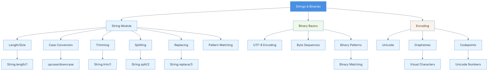

# Chapter 03: Strings and Binaries

## Summary

Chapter 3 delves into string and binary manipulation in Elixir, explaining that strings are UTF-8 encoded binaries. The chapter covers the String module's rich set of functions for common operations like length calculation, case conversion, trimming, splitting, and replacing. It also explores the relationship between strings and binaries, character encoding, grapheme clusters, and binary pattern matching. Understanding these concepts is essential for text processing, parsing, and working with binary data in Elixir applications.

## Concepts Map



## Key Concepts

- **Strings as Binaries**: Elixir strings are UTF-8 encoded binary sequences
- **String Module**: Provides comprehensive functions for string manipulation
- **UTF-8 Encoding**: Variable-length character encoding supporting Unicode
- **Graphemes**: Visual characters that may consist of multiple codepoints
- **Codepoints**: Numeric values representing Unicode characters
- **Binary Pattern Matching**: Matching and extracting data from binary sequences
- **String.length/1**: Returns the number of graphemes in a string
- **Case Conversion**: Functions like `upcase/1` and `downcase/1` for changing case
- **String Trimming**: Removing leading and trailing whitespace with `trim/1`
- **String Splitting**: Breaking strings into lists with `split/2`
- **String Replacement**: Substituting substrings with `replace/3`
- **Sigils**: Special syntax for creating strings and other data structures (e.g., `~s`, `~S`)

## Quiz (20260204_120200)

1. How are strings represented in Elixir?
   - [ ] A. As character arrays
   - [x] B. As UTF-8 encoded binaries
   - [ ] C. As linked lists
   - [ ] D. As special objects

2. What does `String.length("hello")` return?
   - [ ] A. 4
   - [x] B. 5
   - [ ] C. 6
   - [ ] D. An error

3. Which function converts a string to uppercase?
   - [ ] A. `String.upper/1`
   - [x] B. `String.upcase/1`
   - [ ] C. `String.to_upper/1`
   - [ ] D. `String.uppercase/1`

4. What does `String.trim("  hello  ")` return?
   - [ ] A. "  hello  "
   - [x] B. "hello"
   - [ ] C. "hello  "
   - [ ] D. "  hello"

5. How do you split a string by commas?
   - [ ] A. `String.divide("a,b,c", ",")`
   - [x] B. `String.split("a,b,c", ",")`
   - [ ] C. `String.separate("a,b,c", ",")`
   - [ ] D. `String.break("a,b,c", ",")`

6. What is a grapheme?
   - [ ] A. A byte in a string
   - [ ] B. A character encoding
   - [x] C. A visual character that may consist of multiple codepoints
   - [ ] D. A string function

7. What does `String.replace("hello world", "world", "Elixir")` return?
   - [ ] A. "hello Elixir world"
   - [x] B. "hello Elixir"
   - [ ] C. "Elixir world"
   - [ ] D. "hello"

8. What is UTF-8?
   - [ ] A. A programming language
   - [x] B. A variable-length character encoding
   - [ ] C. A string function
   - [ ] D. A data type

9. What is a codepoint?
   - [ ] A. A point in code
   - [x] B. A numeric value representing a Unicode character
   - [ ] C. A debugging marker
   - [ ] D. A string index

10. Can you use pattern matching with binaries in Elixir?
    - [x] A. Yes, using binary pattern syntax
    - [ ] B. No, binaries cannot be matched
    - [ ] C. Only with special functions
    - [ ] D. Only for small binaries

### Answers
1. B, 2. B, 3. B, 4. B, 5. B, 6. C, 7. B, 8. B, 9. B, 10. A

## Challenge

**Task**: Create a text processing module that demonstrates various string and binary manipulation techniques.

Implement a module called `TextProcessor` with the following functions:
1. `word_count/1` - Counts words in a text
2. `reverse_words/1` - Reverses each word in a sentence
3. `acronym/1` - Creates an acronym from the first letters of words
4. `censor_words/2` - Replaces specified words with asterisks
5. `extract_emails/1` - Extracts email addresses from text using pattern matching

### Answer

```elixir
defmodule TextProcessor do
  @moduledoc """
  Text processing utilities demonstrating string and binary manipulation.
  """

  @doc """
  Counts the number of words in a text.
  """
  def word_count(text) do
    text
    |> String.trim()
    |> String.split(~r/\s+/, trim: true)
    |> length()
  end

  @doc """
  Reverses each word in a sentence while maintaining word order.
  """
  def reverse_words(text) do
    text
    |> String.split(" ")
    |> Enum.map(&String.reverse/1)
    |> Enum.join(" ")
  end

  @doc """
  Creates an acronym from the first letters of words.
  Converts to uppercase.
  """
  def acronym(text) do
    text
    |> String.trim()
    |> String.split(~r/\s+/, trim: true)
    |> Enum.map(&String.first/1)
    |> Enum.join()
    |> String.upcase()
  end

  @doc """
  Replaces specified words with asterisks of equal length.
  """
  def censor_words(text, words_to_censor) do
    Enum.reduce(words_to_censor, text, fn word, acc ->
      replacement = String.duplicate("*", String.length(word))
      String.replace(acc, word, replacement, global: true)
    end)
  end

  @doc """
  Extracts email addresses from text.
  Simple regex pattern for demonstration.
  """
  def extract_emails(text) do
    ~r/[\w._%+-]+@[\w.-]+\.\w{2,}/
    |> Regex.scan(text)
    |> List.flatten()
    |> Enum.uniq()
  end
  
  @doc """
  Demonstrates binary pattern matching by parsing a simple protocol.
  Format: <<version::8, type::8, length::16, payload::binary>>
  """
  def parse_packet(<<version::8, type::8, length::16, payload::binary>>) do
    %{
      version: version,
      type: type,
      length: length,
      payload: payload
    }
  end
  
  def parse_packet(_), do: {:error, :invalid_packet}
  
  @doc """
  Checks if a string is a palindrome (ignoring case and spaces).
  """
  def palindrome?(text) do
    normalized = 
      text
      |> String.downcase()
      |> String.replace(~r/\s+/, "")
    
    normalized == String.reverse(normalized)
  end
  
  @doc """
  Counts character frequency in a string.
  """
  def char_frequency(text) do
    text
    |> String.graphemes()
    |> Enum.reduce(%{}, fn char, acc ->
      Map.update(acc, char, 1, &(&1 + 1))
    end)
  end
end

# Usage examples:
# TextProcessor.word_count("Hello world from Elixir")
# => 4

# TextProcessor.reverse_words("Hello world from Elixir")
# => "olleH dlrow morf rixilE"

# TextProcessor.acronym("Open Telecom Platform")
# => "OTP"

# TextProcessor.censor_words("This is bad and ugly", ["bad", "ugly"])
# => "This is *** and ****"

# TextProcessor.extract_emails("Contact us at support@example.com or sales@example.org")
# => ["support@example.com", "sales@example.org"]

# TextProcessor.palindrome?("A man a plan a canal Panama")
# => true

# TextProcessor.char_frequency("hello")
# => %{"h" => 1, "e" => 1, "l" => 2, "o" => 1}

# Binary pattern matching example:
# packet = <<1, 2, 0, 10, "hello world">>
# TextProcessor.parse_packet(packet)
# => %{version: 1, type: 2, length: 10, payload: "hello world"}
```

This implementation demonstrates:
- **String Module Functions**: Using various String functions for manipulation
- **Regular Expressions**: Pattern matching with `~r//` sigils
- **Binary Pattern Matching**: Parsing binary data with pattern syntax
- **Pipe Operator**: Chaining operations for readability
- **Graphemes**: Working with Unicode characters
- **Functional Transformations**: Using `Enum.map` and `Enum.reduce`
