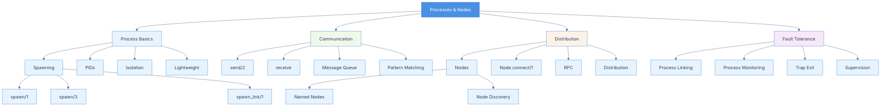

# Chapter 05: Processes and Nodes

## Summary

Chapter 5 explores Elixir's concurrency model and distributed computing capabilities. It covers the fundamentals of lightweight processes as units of concurrency, message passing for inter-process communication, process spawning and monitoring, and distributed computing across nodes. The chapter demonstrates that writing concurrent programs and distributed systems in Elixir is straightforward and accessible, leveraging the BEAM VM's robust concurrency primitives. Understanding these concepts is essential for building scalable, fault-tolerant, and highly concurrent applications.

## Concepts Map



## Key Concepts

- **Processes**: Lightweight, isolated units of concurrency in Elixir/Erlang
- **Process ID (PID)**: Unique identifier for each process
- **Message Passing**: Inter-process communication through asynchronous messages
- **spawn/1**: Creates a new process from a function
- **send/2**: Sends a message to a process
- **receive**: Pattern matches and processes messages from the mailbox
- **Process Isolation**: Processes don't share memory, ensuring safety
- **Nodes**: Named instances of the Erlang runtime system
- **Distributed Elixir**: Running code across multiple connected nodes
- **Node.connect/1**: Establishes connection between nodes
- **RPC (Remote Procedure Call)**: Executing code on remote nodes
- **Process Linking**: Bidirectional connection where linked processes fail together
- **Process Monitoring**: One-way observation of process status
- **Mailbox**: Queue where process messages are stored
- **ETS (Erlang Term Storage)**: In-memory storage for concurrent access

## Quiz (20260204_120400)

1. What are processes in Elixir?
   - [ ] A. Heavy operating system threads
   - [x] B. Lightweight, isolated units of concurrency
   - [ ] C. Functions that run in parallel
   - [ ] D. Database connections

2. What does PID stand for?
   - [ ] A. Process Internal Data
   - [x] B. Process Identifier
   - [ ] C. Parallel Instance Descriptor
   - [ ] D. Program ID

3. How do processes communicate in Elixir?
   - [ ] A. Shared memory
   - [x] B. Message passing
   - [ ] C. Global variables
   - [ ] D. Database

4. Which function creates a new process?
   - [ ] A. `create/1`
   - [ ] B. `new_process/1`
   - [x] C. `spawn/1`
   - [ ] D. `fork/1`

5. What function sends a message to a process?
   - [x] A. `send/2`
   - [ ] B. `message/2`
   - [ ] C. `transmit/2`
   - [ ] D. `post/2`

6. What is a node in Elixir?
   - [ ] A. A data structure
   - [x] B. A named instance of the Erlang runtime
   - [ ] C. A network connection
   - [ ] D. A process type

7. How do you connect to another node?
   - [ ] A. `connect_node/1`
   - [x] B. `Node.connect/1`
   - [ ] C. `link_node/1`
   - [ ] D. `join/1`

8. Do processes share memory in Elixir?
   - [ ] A. Yes, for efficiency
   - [x] B. No, they are isolated
   - [ ] C. Only when linked
   - [ ] D. Only on the same node

9. What happens when you link two processes?
   - [ ] A. They share memory
   - [ ] B. They run in parallel
   - [x] C. They fail together if one fails
   - [ ] D. Nothing special

10. What is process monitoring?
    - [ ] A. Watching process output
    - [x] B. One-way observation of process status
    - [ ] C. Debugging processes
    - [ ] D. Logging process activity

### Answers
1. B, 2. B, 3. B, 4. C, 5. A, 6. B, 7. B, 8. B, 9. C, 10. B

## Challenge

**Task**: Create a concurrent task manager that demonstrates process spawning, message passing, and process monitoring.

Implement a `TaskManager` module that:
1. Spawns worker processes to execute tasks concurrently
2. Tracks task status using message passing
3. Monitors worker processes for failures
4. Implements a simple work queue
5. Provides a result aggregator

### Answer

```elixir
defmodule TaskManager do
  @moduledoc """
  A concurrent task manager demonstrating process spawning,
  message passing, and monitoring.
  """
  
  defmodule Worker do
    @doc """
    Worker process that executes tasks and reports results.
    """
    def start(manager_pid, task_id, task_fn) do
      try do
        result = task_fn.()
        send(manager_pid, {:task_complete, task_id, self(), {:ok, result}})
      rescue
        error ->
          send(manager_pid, {:task_complete, task_id, self(), {:error, error}})
      end
    end
  end
  
  @doc """
  Starts the task manager and returns its PID.
  """
  def start_link do
    spawn_link(fn -> loop(%{tasks: %{}, results: %{}, monitors: %{}}) end)
  end
  
  @doc """
  Submits a task to be executed.
  Returns a task ID for tracking.
  """
  def submit_task(manager_pid, task_fn) do
    task_id = make_ref()
    send(manager_pid, {:submit, task_id, task_fn})
    task_id
  end
  
  @doc """
  Gets the result of a completed task.
  """
  def get_result(manager_pid, task_id) do
    send(manager_pid, {:get_result, task_id, self()})
    
    receive do
      {:result, ^task_id, result} -> result
    after
      5000 -> {:error, :timeout}
    end
  end
  
  @doc """
  Gets all results.
  """
  def get_all_results(manager_pid) do
    send(manager_pid, {:get_all_results, self()})
    
    receive do
      {:all_results, results} -> results
    after
      5000 -> {:error, :timeout}
    end
  end
  
  @doc """
  Main loop handling messages.
  """
  defp loop(state) do
    receive do
      {:submit, task_id, task_fn} ->
        # Spawn worker and monitor it
        worker_pid = spawn(Worker, :start, [self(), task_id, task_fn])
        monitor_ref = Process.monitor(worker_pid)
        
        new_state = state
        |> put_in([:tasks, task_id], %{pid: worker_pid, status: :running})
        |> put_in([:monitors, monitor_ref], task_id)
        
        IO.puts("Task #{inspect(task_id)} submitted, worker: #{inspect(worker_pid)}")
        loop(new_state)
      
      {:task_complete, task_id, worker_pid, result} ->
        new_state = state
        |> put_in([:tasks, task_id, :status], :completed)
        |> put_in([:results, task_id], result)
        
        IO.puts("Task #{inspect(task_id)} completed with result: #{inspect(result)}")
        loop(new_state)
      
      {:DOWN, monitor_ref, :process, _pid, reason} ->
        task_id = state.monitors[monitor_ref]
        
        new_state = if task_id do
          IO.puts("Worker for task #{inspect(task_id)} died: #{inspect(reason)}")
          
          state
          |> put_in([:tasks, task_id, :status], :failed)
          |> put_in([:results, task_id], {:error, {:worker_died, reason}})
          |> update_in([:monitors], &Map.delete(&1, monitor_ref))
        else
          state
        end
        
        loop(new_state)
      
      {:get_result, task_id, caller_pid} ->
        result = Map.get(state.results, task_id, {:error, :not_found})
        send(caller_pid, {:result, task_id, result})
        loop(state)
      
      {:get_all_results, caller_pid} ->
        send(caller_pid, {:all_results, state.results})
        loop(state)
      
      :stop ->
        IO.puts("Task manager stopping...")
        :ok
      
      other ->
        IO.puts("Unknown message: #{inspect(other)}")
        loop(state)
    end
  end
end

# Distributed example module
defmodule DistributedTaskManager do
  @moduledoc """
  Demonstrates distributed computing across nodes.
  """
  
  @doc """
  Executes a function on a remote node.
  """
  def execute_on_node(node, module, function, args) do
    case Node.connect(node) do
      true ->
        :rpc.call(node, module, function, args)
      
      false ->
        {:error, :node_connection_failed}
      
      :ignored ->
        {:error, :node_connection_ignored}
    end
  end
  
  @doc """
  Lists all connected nodes.
  """
  def list_nodes do
    [Node.self() | Node.list()]
  end
  
  @doc """
  Spawns a process on a remote node.
  """
  def spawn_on_node(node, module, function, args) do
    Node.spawn(node, module, function, args)
  end
end

# Usage examples:

# 1. Basic task manager usage
# manager = TaskManager.start_link()
# 
# task1 = TaskManager.submit_task(manager, fn ->
#   :timer.sleep(1000)
#   "Task 1 complete"
# end)
# 
# task2 = TaskManager.submit_task(manager, fn ->
#   :timer.sleep(500)
#   42 * 2
# end)
# 
# task3 = TaskManager.submit_task(manager, fn ->
#   :timer.sleep(200)
#   raise "Simulated error"
# end)
# 
# # Wait a bit for tasks to complete
# :timer.sleep(2000)
# 
# TaskManager.get_result(manager, task1)
# # => {:ok, "Task 1 complete"}
# 
# TaskManager.get_result(manager, task2)
# # => {:ok, 84}
# 
# TaskManager.get_result(manager, task3)
# # => {:error, %RuntimeError{message: "Simulated error"}}
# 
# TaskManager.get_all_results(manager)
# # => %{task_id1 => {:ok, ...}, task_id2 => {:ok, ...}, task_id3 => {:error, ...}}

# 2. Distributed computing example
# Start two nodes in separate terminals:
# Terminal 1: iex --sname node1@localhost
# Terminal 2: iex --sname node2@localhost

# On node1:
# DistributedTaskManager.execute_on_node(
#   :node2@localhost,
#   IO,
#   :puts,
#   ["Hello from node1!"]
# )

# 3. Simple message passing example
defmodule MessageExample do
  def receiver do
    receive do
      {:hello, sender} ->
        IO.puts("Received hello from #{inspect(sender)}")
        send(sender, {:reply, self(), "Hello back!"})
        receiver()
      
      :stop ->
        IO.puts("Stopping receiver")
      
      other ->
        IO.puts("Received unknown message: #{inspect(other)}")
        receiver()
    end
  end
  
  def sender(receiver_pid) do
    send(receiver_pid, {:hello, self()})
    
    receive do
      {:reply, from, message} ->
        IO.puts("Got reply from #{inspect(from)}: #{message}")
    after
      5000 ->
        IO.puts("Timeout waiting for reply")
    end
  end
end

# Usage:
# receiver_pid = spawn(MessageExample, :receiver, [])
# MessageExample.sender(receiver_pid)
# send(receiver_pid, :stop)
```

This implementation demonstrates:
- **Process Spawning**: Creating worker processes with `spawn/3`
- **Message Passing**: Communication using `send/2` and `receive`
- **Process Monitoring**: Using `Process.monitor/1` to track worker health
- **Pattern Matching**: Handling different message types
- **Concurrency**: Multiple tasks executing in parallel
- **Fault Tolerance**: Handling worker failures gracefully
- **Distributed Computing**: Examples of running code on remote nodes
- **State Management**: Maintaining state in a loop-based process
