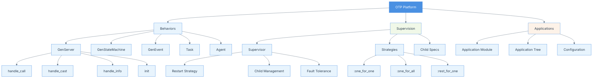

# Chapter 06: OTP – Open Telecom Platform
## Summary

Chapter 6 introduces OTP (Open Telecom Platform), a collection of design principles, patterns, and libraries for building robust, fault-tolerant, and scalable systems. It covers the fundamental building blocks including GenServer (generic server behavior), Supervisors (process managers), and Applications (top-level structures). The chapter demonstrates how OTP systematizes common programming patterns, provides error handling mechanisms, and enables the creation of resilient systems that can self-heal through supervision trees. Understanding OTP is essential for building production-ready Elixir applications.

## Concepts Map



## Key Concepts

- **OTP (Open Telecom Platform)**: Framework of design principles and libraries for building fault-tolerant systems
- **GenServer**: Generic server behavior for implementing client-server patterns
- **Supervisor**: Special process that monitors and manages child processes
- **Application**: Top-level structure bundling modules, resources, and configuration
- **Supervision Tree**: Hierarchical structure of supervisors and workers
- **Restart Strategies**: Policies defining how supervisors restart failed children (`:one_for_one`, `:one_for_all`, `:rest_for_one`)
- **handle_call/3**: Synchronous request handler in GenServer
- **handle_cast/2**: Asynchronous request handler in GenServer
- **handle_info/2**: Handler for non-OTP messages in GenServer
- **init/1**: Initialization callback for GenServer and Supervisor
- **Child Specification**: Configuration defining how a supervisor starts and manages a child
- **Let It Crash**: Philosophy of allowing processes to fail and restart rather than defensive programming
- **Agent**: Simple wrapper around state for basic state management
- **Task**: Abstraction for one-off computations that may be awaited

## Quiz (20260204_120500)

1. What does OTP stand for?
   - [ ] A. Optimal Telecom Protocol
   - [x] B. Open Telecom Platform
   - [ ] C. Object-oriented Testing Platform
   - [ ] D. Organized Task Processing

2. What is GenServer?
   - [ ] A. A generic web server
   - [x] B. A generic server behavior for client-server patterns
   - [ ] C. A database server
   - [ ] D. A file server

3. What is a Supervisor?
   - [x] A. A process that monitors and manages child processes
   - [ ] B. A debugging tool
   - [ ] C. A type of GenServer
   - [ ] D. A configuration manager

4. What is the `:one_for_one` restart strategy?
   - [x] A. Restart only the failed child
   - [ ] B. Restart all children
   - [ ] C. Restart the failed child and all children started after it
   - [ ] D. Don't restart any children

5. What callback handles synchronous requests in GenServer?
   - [x] A. `handle_call/3`
   - [ ] B. `handle_sync/3`
   - [ ] C. `handle_request/3`
   - [ ] D. `handle_message/3`

6. What callback handles asynchronous requests in GenServer?
   - [ ] A. `handle_async/2`
   - [x] B. `handle_cast/2`
   - [ ] C. `handle_send/2`
   - [ ] D. `handle_message/2`

7. What is the "Let It Crash" philosophy?
   - [ ] A. Don't handle errors
   - [ ] B. Crash the entire system
   - [x] C. Allow processes to fail and restart rather than defensive programming
   - [ ] D. Never use try-catch

8. What is an Application in OTP?
   - [ ] A. A user-facing program
   - [x] B. Top-level structure bundling modules and resources
   - [ ] C. A type of process
   - [ ] D. A web application

9. What does `init/1` callback do in GenServer?
   - [ ] A. Starts the server
   - [x] B. Initializes the server state
   - [ ] C. Handles messages
   - [ ] D. Stops the server

10. What is an Agent in OTP?
    - [ ] A. A spy program
    - [ ] B. A type of supervisor
    - [x] C. Simple wrapper around state for basic state management
    - [ ] D. A network agent

### Answers
1. B, 2. B, 3. A, 4. A, 5. A, 6. B, 7. C, 8. B, 9. B, 10. C

## Challenge

**Task**: Build a fault-tolerant URL shortener service using OTP principles.

Create a complete OTP application that:
1. Uses GenServer to manage URL mappings
2. Implements a Supervisor to ensure the service restarts on failure
3. Provides an Application module for proper startup
4. Handles both synchronous and asynchronous operations
5. Demonstrates fault tolerance by recovering from crashes

### Answer

```elixir
# 1. GenServer implementation for URL shortener
defmodule UrlShortener.Server do
  use GenServer
  require Logger
  
  @moduledoc """
  GenServer managing URL shortening and retrieval.
  """
  
  # Client API
  
  def start_link(opts \\ []) do
    GenServer.start_link(__MODULE__, :ok, opts ++ [name: __MODULE__])
  end
  
  @doc """
  Shortens a URL synchronously.
  """
  def shorten_url(long_url) do
    GenServer.call(__MODULE__, {:shorten, long_url})
  end
  
  @doc """
  Retrieves original URL synchronously.
  """
  def get_url(short_code) do
    GenServer.call(__MODULE__, {:get, short_code})
  end
  
  @doc """
  Gets all mappings.
  """
  def get_all do
    GenServer.call(__MODULE__, :get_all)
  end
  
  @doc """
  Deletes a mapping asynchronously.
  """
  def delete_url(short_code) do
    GenServer.cast(__MODULE__, {:delete, short_code})
  end
  
  @doc """
  Gets statistics asynchronously via info message.
  """
  def get_stats do
    send(__MODULE__, {:get_stats, self()})
    
    receive do
      {:stats, stats} -> stats
    after
      5000 -> {:error, :timeout}
    end
  end
  
  # Server Callbacks
  
  @impl true
  def init(:ok) do
    Logger.info("URL Shortener Server starting...")
    {:ok, %{urls: %{}, counter: 0}}
  end
  
  @impl true
  def handle_call({:shorten, long_url}, _from, state) do
    # Generate short code
    short_code = generate_code(state.counter)
    new_urls = Map.put(state.urls, short_code, long_url)
    new_state = %{state | urls: new_urls, counter: state.counter + 1}
    
    Logger.info("Shortened URL: #{long_url} -> #{short_code}")
    {:reply, {:ok, short_code}, new_state}
  end
  
  @impl true
  def handle_call({:get, short_code}, _from, state) do
    case Map.get(state.urls, short_code) do
      nil -> {:reply, {:error, :not_found}, state}
      url -> {:reply, {:ok, url}, state}
    end
  end
  
  @impl true
  def handle_call(:get_all, _from, state) do
    {:reply, state.urls, state}
  end
  
  @impl true
  def handle_cast({:delete, short_code}, state) do
    new_urls = Map.delete(state.urls, short_code)
    Logger.info("Deleted short code: #{short_code}")
    {:noreply, %{state | urls: new_urls}}
  end
  
  @impl true
  def handle_info({:get_stats, caller_pid}, state) do
    stats = %{
      total_urls: map_size(state.urls),
      counter: state.counter
    }
    send(caller_pid, {:stats, stats})
    {:noreply, state}
  end
  
  @impl true
  def handle_info(msg, state) do
    Logger.warning("Unexpected message: #{inspect(msg)}")
    {:noreply, state}
  end
  
  # Private helpers
  
  defp generate_code(counter) do
    counter
    |> Integer.to_string(36)
    |> String.downcase()
  end
end

# 2. Supervisor implementation
defmodule UrlShortener.Supervisor do
  use Supervisor
  
  @moduledoc """
  Supervisor ensuring URL Shortener service reliability.
  """
  
  def start_link(init_arg) do
    Supervisor.start_link(__MODULE__, init_arg, name: __MODULE__)
  end
  
  @impl true
  def init(_init_arg) do
    children = [
      # The URL Shortener server
      {UrlShortener.Server, []},
      
      # Could add more workers here:
      # {UrlShortener.Cache, []},
      # {UrlShortener.Analytics, []}
    ]
    
    # :one_for_one means only restart the failed child
    Supervisor.init(children, strategy: :one_for_one)
  end
end

# 3. Application module
defmodule UrlShortener.Application do
  use Application
  require Logger
  
  @moduledoc """
  Application module for URL Shortener.
  """
  
  @impl true
  def start(_type, _args) do
    Logger.info("Starting URL Shortener Application...")
    UrlShortener.Supervisor.start_link([])
  end
  
  @impl true
  def stop(_state) do
    Logger.info("Stopping URL Shortener Application...")
    :ok
  end
end

# 4. Additional OTP behaviors

# Simple Agent-based counter
defmodule UrlShortener.Counter do
  use Agent
  
  def start_link(initial_value \\ 0) do
    Agent.start_link(fn -> initial_value end, name: __MODULE__)
  end
  
  def increment do
    Agent.update(__MODULE__, &(&1 + 1))
  end
  
  def get do
    Agent.get(__MODULE__, & &1)
  end
end

# Task-based asynchronous URL validation
defmodule UrlShortener.Validator do
  @moduledoc """
  Validates URLs asynchronously using Task.
  """
  
  def validate_url_async(url) do
    Task.async(fn ->
      validate_url(url)
    end)
  end
  
  def validate_url(url) do
    uri = URI.parse(url)
    
    cond do
      uri.scheme not in ["http", "https"] ->
        {:error, :invalid_scheme}
      
      is_nil(uri.host) ->
        {:error, :invalid_host}
      
      true ->
        {:ok, :valid}
    end
  end
end

# Usage Examples:

# Start the application (normally done automatically)
# {:ok, _pid} = UrlShortener.Application.start(:normal, [])

# Shorten URLs
# {:ok, code1} = UrlShortener.Server.shorten_url("https://example.com/very/long/url")
# => {:ok, "0"}

# {:ok, code2} = UrlShortener.Server.shorten_url("https://github.com/elixir-lang/elixir")
# => {:ok, "1"}

# Get original URL
# UrlShortener.Server.get_url("0")
# => {:ok, "https://example.com/very/long/url"}

# Get all mappings
# UrlShortener.Server.get_all()
# => %{"0" => "https://example.com/very/long/url", "1" => "https://github.com/elixir-lang/elixir"}

# Delete a mapping (async)
# UrlShortener.Server.delete_url("1")
# => :ok

# Get statistics
# UrlShortener.Server.get_stats()
# => %{total_urls: 1, counter: 2}

# Validate URL asynchronously
# task = UrlShortener.Validator.validate_url_async("https://example.com")
# Task.await(task)
# => {:ok, :valid}

# Demonstrate fault tolerance:
# Get the PID
# pid = Process.whereis(UrlShortener.Server)

# Add some URLs
# UrlShortener.Server.shorten_url("https://test.com")

# Simulate crash
# Process.exit(pid, :kill)

# The supervisor will restart it automatically
# :timer.sleep(100)

# Server is back! (but state is reset - in production, you'd persist state)
# UrlShortener.Server.get_all()
# => %{}
```

**mix.exs configuration for the application:**

```elixir
defmodule UrlShortener.MixProject do
  use Mix.Project

  def project do
    [
      app: :url_shortener,
      version: "0.1.0",
      elixir: "~> 1.14",
      start_permanent: Mix.env() == :prod,
      deps: deps()
    ]
  end

  def application do
    [
      extra_applications: [:logger],
      mod: {UrlShortener.Application, []}
    ]
  end

  defp deps do
    []
  end
end
```

This implementation demonstrates:
- **GenServer**: Complete client-server implementation with all callbacks
- **Supervisor**: Process management with `:one_for_one` strategy
- **Application**: Proper OTP application structure
- **Fault Tolerance**: Automatic restart on crashes
- **Multiple Callbacks**: `handle_call`, `handle_cast`, and `handle_info`
- **Agent**: Simple state management alternative
- **Task**: Asynchronous computation
- **Logging**: Proper logging throughout
- **OTP Conventions**: Following standard OTP patterns and practices