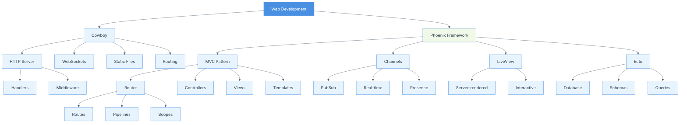

# Chapter 07: Cowboy and Phoenix

## Summary

Chapter 7 explores web development in Elixir using Cowboy and Phoenix. Cowboy is a small, fast HTTP server written in Erlang, while Phoenix is a productive web framework built on top of Elixir and Cowboy. The chapter covers serving static files, implementing WebSockets for real-time communication, routing, controllers, views, templates, Phoenix channels for pub/sub, and SSL configuration. Understanding these technologies enables developers to build high-performance, real-time web applications leveraging Elixir's concurrency model.

## Concepts Map



## Key Concepts

- **Cowboy**: Small, fast, modular HTTP server for Erlang/Elixir
- **Phoenix**: Full-featured web framework for building scalable web applications
- **MVC Pattern**: Model-View-Controller architecture for organizing web applications
- **Router**: Defines URL patterns and maps them to controllers
- **Controllers**: Handle requests and prepare responses
- **Views**: Render data into HTML or other formats
- **Templates**: Define the structure and layout of HTML pages
- **Channels**: Abstraction for real-time, bidirectional communication
- **PubSub**: Publish-subscribe pattern for broadcasting messages
- **WebSockets**: Protocol for full-duplex communication over TCP
- **Plug**: Composable modules for building web applications
- **Pipeline**: Series of plugs that process requests
- **LiveView**: Server-rendered real-time interfaces without JavaScript
- **Presence**: Track user presence across distributed systems
- **Ecto**: Database wrapper and query generator

## Quiz (20260204_120600)

1. What is Cowboy?
   - [x] A. A small, fast HTTP server for Erlang/Elixir
   - [ ] B. A web framework
   - [ ] C. A database
   - [ ] D. A templating engine

2. What is Phoenix?
   - [ ] A. A programming language
   - [x] B. A web framework for Elixir
   - [ ] C. A web server
   - [ ] D. A database

3. What pattern does Phoenix follow?
   - [ ] A. MVP
   - [x] B. MVC (Model-View-Controller)
   - [ ] C. MVVM
   - [ ] D. Singleton

4. What are Phoenix Channels used for?
   - [ ] A. Database connections
   - [x] B. Real-time, bidirectional communication
   - [ ] C. Routing
   - [ ] D. Authentication

5. What is a Plug?
   - [ ] A. A hardware component
   - [x] B. A composable module for web applications
   - [ ] C. A database plugin
   - [ ] D. A CSS framework

6. What is LiveView?
   - [ ] A. A video streaming service
   - [ ] B. A database viewer
   - [x] C. Server-rendered real-time interfaces
   - [ ] D. A monitoring tool

7. What protocol do WebSockets use?
   - [ ] A. HTTP only
   - [ ] B. UDP
   - [x] C. Full-duplex over TCP
   - [ ] D. FTP

8. What is Ecto?
   - [ ] A. A web server
   - [x] B. Database wrapper and query generator
   - [ ] C. A template engine
   - [ ] D. A testing framework

9. What is the Router in Phoenix?
   - [x] A. Defines URL patterns and maps to controllers
   - [ ] B. Network routing hardware
   - [ ] C. A database router
   - [ ] D. A file system router

10. What is Phoenix Presence?
    - [ ] A. Authentication system
    - [x] B. Tracks user presence across distributed systems
    - [ ] C. Monitoring tool
    - [ ] D. Database connection pool

### Answers
1. A, 2. B, 3. B, 4. B, 5. B, 6. C, 7. C, 8. B, 9. A, 10. B

## Challenge

**Task**: Build a real-time chat application using Phoenix Channels.

Create a Phoenix application that:
1. Sets up routes for a chat room
2. Implements a Channel for real-time messaging
3. Creates a simple HTML interface
4. Handles user joining/leaving events
5. Broadcasts messages to all connected users

### Answer

```elixir
# 1. Router configuration (lib/chat_app_web/router.ex)
defmodule ChatAppWeb.Router do
  use ChatAppWeb, :router

  pipeline :browser do
    plug :accepts, ["html"]
    plug :fetch_session
    plug :fetch_live_flash
    plug :put_root_layout, {ChatAppWeb.LayoutView, :root}
    plug :protect_from_forgery
    plug :put_secure_browser_headers
  end

  scope "/", ChatAppWeb do
    pipe_through :browser

    get "/", PageController, :index
    get "/chat", ChatController, :index
  end
end

# 2. Chat Controller (lib/chat_app_web/controllers/chat_controller.ex)
defmodule ChatAppWeb.ChatController do
  use ChatAppWeb, :controller

  def index(conn, _params) do
    render(conn, "index.html")
  end
end

# 3. Socket configuration (lib/chat_app_web/channels/user_socket.ex)
defmodule ChatAppWeb.UserSocket do
  use Phoenix.Socket

  # Channels
  channel "room:*", ChatAppWeb.RoomChannel

  # Socket params are passed from the client and can be used
  # to verify and authenticate a user. After verification,
  # you can put default assigns into the socket that will
  # be set for all channels.
  @impl true
  def connect(%{"username" => username}, socket, _connect_info) do
    {:ok, assign(socket, :username, username)}
  end

  def connect(_params, _socket, _connect_info) do
    :error
  end

  @impl true
  def id(socket), do: "user_socket:#{socket.assigns.username}"
end

# 4. Room Channel (lib/chat_app_web/channels/room_channel.ex)
defmodule ChatAppWeb.RoomChannel do
  use ChatAppWeb, :channel
  require Logger

  @impl true
  def join("room:lobby", payload, socket) do
    if authorized?(payload) do
      username = socket.assigns.username
      
      # Notify others that user joined
      broadcast!(socket, "user_joined", %{
        username: username,
        timestamp: DateTime.utc_now() |> DateTime.to_iso8601()
      })
      
      Logger.info("User #{username} joined room:lobby")
      
      {:ok, %{message: "Welcome to the chat!"}, socket}
    else
      {:error, %{reason: "unauthorized"}}
    end
  end

  # Catch-all for other rooms
  def join("room:" <> _private_room_id, _payload, _socket) do
    {:error, %{reason: "unauthorized"}}
  end

  # Handle incoming messages
  @impl true
  def handle_in("new_message", %{"body" => body}, socket) do
    username = socket.assigns.username
    
    message = %{
      username: username,
      body: body,
      timestamp: DateTime.utc_now() |> DateTime.to_iso8601()
    }
    
    broadcast!(socket, "new_message", message)
    {:reply, {:ok, message}, socket}
  end

  # Handle typing notifications
  @impl true
  def handle_in("user_typing", _payload, socket) do
    username = socket.assigns.username
    broadcast_from!(socket, "user_typing", %{username: username})
    {:noreply, socket}
  end

  # Handle user leaving
  @impl true
  def terminate(reason, socket) do
    username = socket.assigns.username
    
    broadcast!(socket, "user_left", %{
      username: username,
      timestamp: DateTime.utc_now() |> DateTime.to_iso8601()
    })
    
    Logger.info("User #{username} left room:lobby: #{inspect(reason)}")
    :ok
  end

  # Authorization check
  defp authorized?(_payload) do
    # Add your authorization logic here
    true
  end
end

# 5. Endpoint configuration (lib/chat_app_web/endpoint.ex)
defmodule ChatAppWeb.Endpoint do
  use Phoenix.Endpoint, otp_app: :chat_app

  # Socket configuration
  socket "/socket", ChatAppWeb.UserSocket,
    websocket: true,
    longpoll: false

  # ... other endpoint configuration ...
end

# 6. HTML Template (lib/chat_app_web/templates/chat/index.html.heex)
"""
<div class="chat-container">
  <h1>Real-Time Chat Room</h1>
  
  <div id="username-form" class="username-section">
    <input type="text" id="username-input" placeholder="Enter your username" />
    <button id="join-button">Join Chat</button>
  </div>

  <div id="chat-section" style="display: none;">
    <div id="messages" class="messages-container"></div>
    
    <div class="typing-indicator" id="typing-indicator" style="display: none;">
      <em>Someone is typing...</em>
    </div>
    
    <div class="message-form">
      <input type="text" id="message-input" placeholder="Type a message..." />
      <button id="send-button">Send</button>
    </div>
  </div>
</div>

<script>
  // Get DOM elements
  const usernameForm = document.getElementById('username-form');
  const usernameInput = document.getElementById('username-input');
  const joinButton = document.getElementById('join-button');
  const chatSection = document.getElementById('chat-section');
  const messagesContainer = document.getElementById('messages');
  const messageInput = document.getElementById('message-input');
  const sendButton = document.getElementById('send-button');
  const typingIndicator = document.getElementById('typing-indicator');

  let channel;
  let socket;
  let typingTimeout;

  // Join chat room
  joinButton.addEventListener('click', () => {
    const username = usernameInput.value.trim();
    
    if (!username) {
      alert('Please enter a username');
      return;
    }

    // Connect to socket with username
    socket = new Phoenix.Socket("/socket", {
      params: { username: username }
    });
    
    socket.connect();

    // Join the lobby channel
    channel = socket.channel("room:lobby", {});
    
    channel.join()
      .receive("ok", resp => {
        console.log("Joined successfully", resp);
        usernameForm.style.display = 'none';
        chatSection.style.display = 'block';
        addSystemMessage(resp.message);
      })
      .receive("error", resp => {
        console.log("Unable to join", resp);
        alert("Unable to join chat room");
      });

    // Listen for new messages
    channel.on("new_message", payload => {
      addMessage(payload.username, payload.body, payload.timestamp);
    });

    // Listen for user joined
    channel.on("user_joined", payload => {
      addSystemMessage(`${payload.username} joined the chat`);
    });

    // Listen for user left
    channel.on("user_left", payload => {
      addSystemMessage(`${payload.username} left the chat`);
    });

    // Listen for typing indicator
    channel.on("user_typing", payload => {
      showTypingIndicator(payload.username);
    });
  });

  // Send message
  function sendMessage() {
    const message = messageInput.value.trim();
    
    if (!message) return;

    channel.push("new_message", { body: message })
      .receive("ok", () => {
        messageInput.value = '';
      })
      .receive("error", e => {
        console.log("Error sending message", e);
      });
  }

  sendButton.addEventListener('click', sendMessage);
  
  messageInput.addEventListener('keypress', (e) => {
    if (e.key === 'Enter') {
      sendMessage();
    } else {
      // Send typing notification
      clearTimeout(typingTimeout);
      channel.push("user_typing", {});
      
      typingTimeout = setTimeout(() => {
        // Stop typing indicator after 2 seconds
      }, 2000);
    }
  });

  // Helper functions
  function addMessage(username, body, timestamp) {
    const messageDiv = document.createElement('div');
    messageDiv.className = 'message';
    
    const time = new Date(timestamp).toLocaleTimeString();
    messageDiv.innerHTML = `
      <strong>${username}</strong> 
      <span class="timestamp">${time}</span>
      <div class="message-body">${escapeHtml(body)}</div>
    `;
    
    messagesContainer.appendChild(messageDiv);
    messagesContainer.scrollTop = messagesContainer.scrollHeight;
  }

  function addSystemMessage(message) {
    const messageDiv = document.createElement('div');
    messageDiv.className = 'system-message';
    messageDiv.textContent = message;
    messagesContainer.appendChild(messageDiv);
    messagesContainer.scrollTop = messagesContainer.scrollHeight;
  }

  function showTypingIndicator(username) {
    typingIndicator.textContent = `${username} is typing...`;
    typingIndicator.style.display = 'block';
    
    setTimeout(() => {
      typingIndicator.style.display = 'none';
    }, 2000);
  }

  function escapeHtml(text) {
    const div = document.createElement('div');
    div.textContent = text;
    return div.innerHTML;
  }
</script>

<style>
  .chat-container {
    max-width: 800px;
    margin: 0 auto;
    padding: 20px;
  }

  .username-section {
    margin: 20px 0;
  }

  .username-section input {
    padding: 10px;
    width: 300px;
    margin-right: 10px;
  }

  .messages-container {
    border: 1px solid #ddd;
    height: 400px;
    overflow-y: auto;
    padding: 10px;
    margin-bottom: 10px;
    background: #f9f9f9;
  }

  .message {
    margin-bottom: 10px;
    padding: 8px;
    background: white;
    border-radius: 4px;
  }

  .system-message {
    text-align: center;
    color: #666;
    font-style: italic;
    margin: 10px 0;
  }

  .timestamp {
    color: #999;
    font-size: 0.8em;
    margin-left: 10px;
  }

  .message-body {
    margin-top: 5px;
  }

  .message-form input {
    padding: 10px;
    width: calc(100% - 120px);
    margin-right: 10px;
  }

  button {
    padding: 10px 20px;
    background: #4A90E2;
    color: white;
    border: none;
    border-radius: 4px;
    cursor: pointer;
  }

  button:hover {
    background: #357ABD;
  }

  .typing-indicator {
    color: #666;
    font-size: 0.9em;
    margin-bottom: 10px;
  }
</style>
"""

# 7. Application configuration (config/config.exs)
"""
import Config

config :chat_app, ChatAppWeb.Endpoint,
  url: [host: "localhost"],
  secret_key_base: "your_secret_key_here",
  render_errors: [view: ChatAppWeb.ErrorView, accepts: ~w(html json), layout: false],
  pubsub_server: ChatApp.PubSub,
  live_view: [signing_salt: "your_signing_salt"]

config :logger, :console,
  format: "$time $metadata[$level] $message\n",
  metadata: [:request_id]
"""
```

**To set up and run the application:**

1. Create a new Phoenix project:
```bash
mix phx.new chat_app
cd chat_app
```

2. Add the channel files as shown above

3. Install dependencies:
```bash
mix deps.get
```

4. Create the database:
```bash
mix ecto.create
```

5. Start the server:
```bash
mix phx.server
```

6. Visit `http://localhost:4000/chat` in multiple browser windows to test

This implementation demonstrates:
- **Phoenix Channels**: Real-time bidirectional communication
- **WebSockets**: Efficient full-duplex connection
- **PubSub**: Broadcasting messages to all connected clients
- **Channel Callbacks**: `join`, `handle_in`, `terminate`
- **Socket Authentication**: Passing username on connection
- **Broadcasting**: `broadcast!` and `broadcast_from!`
- **User Presence**: Join/leave notifications
- **Real-time Features**: Typing indicators
- **Client Integration**: JavaScript Phoenix client
- **HTML/CSS**: Complete user interface
