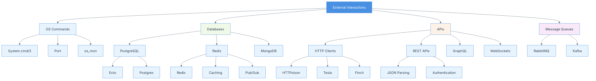

# Chapter 08: Interactions

## Summary

Chapter 8 focuses on interacting with external systems and services from Elixir applications. It covers executing operating system commands, working with databases like PostgreSQL and Redis, integrating with external APIs, and building practical examples like a Twitter feed parser. The chapter demonstrates how Elixir's concurrent model and libraries make it easy to interact with external systems reliably and efficiently. Understanding these interaction patterns is crucial for building real-world applications that integrate with existing infrastructure and services.

## Concepts Map



## Key Concepts

- **System Commands**: Executing OS-level commands from Elixir using `System.cmd/3`
- **Port**: Low-level primitive for communicating with external programs
- **Ecto**: Database wrapper and query generator for SQL databases
- **Postgrex**: PostgreSQL driver for Elixir
- **Redix**: Redis client for Elixir
- **HTTP Clients**: Libraries for making HTTP requests (HTTPoison, Tesla, Finch)
- **JSON Parsing**: Decoding and encoding JSON with Jason or Poison
- **API Integration**: Connecting to external REST, GraphQL, or WebSocket APIs
- **Connection Pooling**: Managing database connections efficiently
- **Caching**: Using Redis or ETS for caching data
- **Message Queues**: Integrating with systems like RabbitMQ or Kafka
- **Stream Processing**: Handling streaming data from APIs or services
- **OAuth**: Authentication protocol for API access
- **Rate Limiting**: Managing API request limits

## Quiz (20260204_120700)

1. Which function executes OS commands in Elixir?
   - [ ] A. `OS.execute/2`
   - [x] B. `System.cmd/3`
   - [ ] C. `Command.run/2`
   - [ ] D. `Exec.command/2`

2. What is Ecto?
   - [ ] A. A web server
   - [x] B. A database wrapper and query generator
   - [ ] C. An authentication library
   - [ ] D. A testing framework

3. Which library is used for PostgreSQL in Elixir?
   - [ ] A. PgEx
   - [x] B. Postgrex
   - [ ] C. PostgresLib
   - [ ] D. PgDriver

4. What is Redix?
   - [ ] A. A database
   - [x] B. A Redis client for Elixir
   - [ ] C. A web framework
   - [ ] D. A message queue

5. Which library is commonly used for HTTP requests?
   - [ ] A. WebClient
   - [ ] B. HttpLib
   - [x] C. HTTPoison or Tesla
   - [ ] D. RequestEx

6. What library is used for JSON parsing in modern Elixir?
   - [ ] A. JsonEx
   - [x] B. Jason
   - [ ] C. JsonParser
   - [ ] D. Decode

7. What is connection pooling?
   - [x] A. Managing database connections efficiently
   - [ ] B. Swimming pool connections
   - [ ] C. Network pooling
   - [ ] D. Thread pooling

8. What is Redis commonly used for?
   - [ ] A. Relational database
   - [x] B. Caching and pub/sub
   - [ ] C. File storage
   - [ ] D. Authentication

9. What is a Port in Elixir?
   - [ ] A. Network port number
   - [x] B. Primitive for communicating with external programs
   - [ ] C. USB port
   - [ ] D. Database port

10. What is OAuth?
    - [ ] A. A database protocol
    - [x] B. An authentication protocol for API access
    - [ ] C. A web framework
    - [ ] D. A caching system

### Answers
1. B, 2. B, 3. B, 4. B, 5. C, 6. B, 7. A, 8. B, 9. B, 10. B

## Challenge

**Task**: Build a complete integration system that demonstrates interactions with multiple external services.

Create a `DataPipeline` system that:
1. Fetches data from a REST API (simulated or real)
2. Stores the data in PostgreSQL
3. Caches frequently accessed data in Redis
4. Executes OS commands for data processing
5. Provides a complete example with error handling

### Answer

```elixir
# 1. Mix dependencies (mix.exs)
"""
defp deps do
  [
    {:ecto_sql, "~> 3.10"},
    {:postgrex, ">= 0.0.0"},
    {:redix, "~> 1.2"},
    {:jason, "~> 1.4"},
    {:tesla, "~> 1.7"},
    {:hackney, "~> 1.18"}
  ]
end
"""

# 2. Database Schema (lib/data_pipeline/schema/article.ex)
defmodule DataPipeline.Schema.Article do
  use Ecto.Schema
  import Ecto.Changeset

  schema "articles" do
    field :title, :string
    field :content, :string
    field :author, :string
    field :url, :string
    field :published_at, :utc_datetime

    timestamps()
  end

  def changeset(article, attrs) do
    article
    |> cast(attrs, [:title, :content, :author, :url, :published_at])
    |> validate_required([:title, :content, :author])
    |> unique_constraint(:url)
  end
end

# 3. PostgreSQL Repository (lib/data_pipeline/repo.ex)
defmodule DataPipeline.Repo do
  use Ecto.Repo,
    otp_app: :data_pipeline,
    adapter: Ecto.Adapters.Postgres
end

# 4. Redis Cache (lib/data_pipeline/cache.ex)
defmodule DataPipeline.Cache do
  @moduledoc """
  Redis-based caching layer.
  """
  
  def start_link do
    Redix.start_link(host: "localhost", port: 6379, name: :redix)
  end
  
  @doc """
  Gets a value from cache.
  """
  def get(key) do
    case Redix.command(:redix, ["GET", key]) do
      {:ok, nil} -> {:error, :not_found}
      {:ok, value} -> {:ok, Jason.decode!(value)}
      error -> error
    end
  end
  
  @doc """
  Sets a value in cache with optional expiration (in seconds).
  """
  def set(key, value, ttl \\ 3600) do
    json_value = Jason.encode!(value)
    
    case Redix.command(:redix, ["SETEX", key, ttl, json_value]) do
      {:ok, "OK"} -> :ok
      error -> error
    end
  end
  
  @doc """
  Deletes a value from cache.
  """
  def delete(key) do
    Redix.command(:redix, ["DEL", key])
  end
  
  @doc """
  Checks if a key exists in cache.
  """
  def exists?(key) do
    case Redix.command(:redix, ["EXISTS", key]) do
      {:ok, 1} -> true
      {:ok, 0} -> false
      _ -> false
    end
  end
end

# 5. HTTP Client (lib/data_pipeline/http_client.ex)
defmodule DataPipeline.HttpClient do
  @moduledoc """
  HTTP client for fetching data from external APIs.
  """
  
  use Tesla
  
  plug Tesla.Middleware.BaseUrl, "https://jsonplaceholder.typicode.com"
  plug Tesla.Middleware.JSON
  plug Tesla.Middleware.Retry, delay: 500, max_retries: 3
  plug Tesla.Middleware.Timeout, timeout: 10_000
  
  @doc """
  Fetches posts from the API.
  """
  def fetch_posts do
    case get("/posts") do
      {:ok, %{status: 200, body: posts}} ->
        {:ok, posts}
      
      {:ok, %{status: status}} ->
        {:error, {:http_error, status}}
      
      {:error, reason} ->
        {:error, reason}
    end
  end
  
  @doc """
  Fetches a single post by ID.
  """
  def fetch_post(id) do
    case get("/posts/#{id}") do
      {:ok, %{status: 200, body: post}} ->
        {:ok, post}
      
      {:ok, %{status: 404}} ->
        {:error, :not_found}
      
      {:ok, %{status: status}} ->
        {:error, {:http_error, status}}
      
      {:error, reason} ->
        {:error, reason}
    end
  end
end

# 6. OS Command Executor (lib/data_pipeline/os_executor.ex)
defmodule DataPipeline.OsExecutor do
  @moduledoc """
  Executes OS commands safely.
  """
  
  require Logger
  
  @doc """
  Executes a system command and returns the result.
  """
  def execute(command, args \\ []) do
    Logger.info("Executing command: #{command} #{Enum.join(args, " ")}")
    
    case System.cmd(command, args, stderr_to_stdout: true) do
      {output, 0} ->
        Logger.info("Command succeeded")
        {:ok, output}
      
      {output, exit_code} ->
        Logger.error("Command failed with exit code #{exit_code}")
        {:error, {:command_failed, exit_code, output}}
    end
  end
  
  @doc """
  Counts words in a file using wc command.
  """
  def count_words(file_path) do
    case execute("wc", ["-w", file_path]) do
      {:ok, output} ->
        count = output
                |> String.trim()
                |> String.split()
                |> List.first()
                |> String.to_integer()
        
        {:ok, count}
      
      error -> error
    end
  end
  
  @doc """
  Processes a file using an external script.
  """
  def process_file(input_path, output_path) do
    execute("cat", [input_path, ">", output_path])
  end
end

# 7. Main Pipeline (lib/data_pipeline/pipeline.ex)
defmodule DataPipeline.Pipeline do
  @moduledoc """
  Main data pipeline orchestrating all operations.
  """
  
  alias DataPipeline.{HttpClient, Repo, Cache, OsExecutor}
  alias DataPipeline.Schema.Article
  import Ecto.Query
  require Logger
  
  @doc """
  Fetches articles from API, caches them, and stores in database.
  """
  def sync_articles do
    Logger.info("Starting article sync...")
    
    with {:ok, posts} <- HttpClient.fetch_posts(),
         :ok <- cache_articles(posts),
         {:ok, stored} <- store_articles(posts) do
      
      Logger.info("Successfully synced #{length(stored)} articles")
      {:ok, stored}
    else
      {:error, reason} = error ->
        Logger.error("Failed to sync articles: #{inspect(reason)}")
        error
    end
  end
  
  @doc """
  Gets an article, checking cache first, then database, then API.
  """
  def get_article(id) do
    cache_key = "article:#{id}"
    
    # Try cache first
    case Cache.get(cache_key) do
      {:ok, article} ->
        Logger.info("Article #{id} found in cache")
        {:ok, article}
      
      {:error, :not_found} ->
        # Try database
        case get_from_database(id) do
          {:ok, article} = result ->
            # Cache for next time
            Cache.set(cache_key, article)
            result
          
          {:error, :not_found} ->
            # Fetch from API
            fetch_and_store_article(id)
        end
    end
  end
  
  defp get_from_database(id) do
    case Repo.get(Article, id) do
      nil -> {:error, :not_found}
      article -> {:ok, article}
    end
  end
  
  defp fetch_and_store_article(id) do
    with {:ok, post} <- HttpClient.fetch_post(id),
         {:ok, article} <- store_article(post) do
      
      # Cache the result
      Cache.set("article:#{id}", article)
      {:ok, article}
    end
  end
  
  defp cache_articles(posts) do
    Enum.each(posts, fn post ->
      Cache.set("article:#{post["id"]}", post, 3600)
    end)
    
    :ok
  end
  
  defp store_articles(posts) do
    articles = Enum.map(posts, fn post ->
      %{
        title: post["title"],
        content: post["body"],
        author: "User #{post["userId"]}",
        url: "https://example.com/posts/#{post["id"]}",
        published_at: DateTime.utc_now(),
        inserted_at: DateTime.utc_now(),
        updated_at: DateTime.utc_now()
      }
    end)
    
    case Repo.insert_all(Article, articles, on_conflict: :nothing) do
      {count, _} -> {:ok, count}
    end
  end
  
  defp store_article(post) do
    attrs = %{
      title: post["title"],
      content: post["body"],
      author: "User #{post["userId"]}",
      url: "https://example.com/posts/#{post["id"]}",
      published_at: DateTime.utc_now()
    }
    
    %Article{}
    |> Article.changeset(attrs)
    |> Repo.insert(on_conflict: :nothing)
  end
  
  @doc """
  Exports articles to a text file.
  """
  def export_articles(output_path) do
    articles = Repo.all(from a in Article, order_by: [desc: a.inserted_at])
    
    content = Enum.map_join(articles, "\n\n---\n\n", fn article ->
      """
      Title: #{article.title}
      Author: #{article.author}
      URL: #{article.url}
      
      #{article.content}
      """
    end)
    
    case File.write(output_path, content) do
      :ok ->
        # Count words in the exported file
        case OsExecutor.count_words(output_path) do
          {:ok, count} ->
            Logger.info("Exported #{length(articles)} articles with #{count} words")
            {:ok, %{articles: length(articles), words: count}}
          
          error -> error
        end
      
      error -> error
    end
  end
  
  @doc """
  Gets statistics about the pipeline.
  """
  def get_stats do
    article_count = Repo.aggregate(Article, :count)
    
    # Get cache stats (example)
    cache_size = case Redix.command(:redix, ["DBSIZE"]) do
      {:ok, size} -> size
      _ -> 0
    end
    
    %{
      total_articles: article_count,
      cache_entries: cache_size,
      database: "PostgreSQL",
      cache: "Redis"
    }
  end
end

# 8. Application Supervisor (lib/data_pipeline/application.ex)
defmodule DataPipeline.Application do
  use Application
  
  def start(_type, _args) do
    children = [
      DataPipeline.Repo,
      {Redix, host: "localhost", port: 6379, name: :redix}
    ]
    
    opts = [strategy: :one_for_one, name: DataPipeline.Supervisor]
    Supervisor.start_link(children, opts)
  end
end

# 9. Database Migration
"""
defmodule DataPipeline.Repo.Migrations.CreateArticles do
  use Ecto.Migration

  def change do
    create table(:articles) do
      add :title, :string, null: false
      add :content, :text, null: false
      add :author, :string, null: false
      add :url, :string
      add :published_at, :utc_datetime

      timestamps()
    end

    create unique_index(:articles, [:url])
  end
end
"""

# Usage examples:

# 1. Sync articles from API to database and cache
# DataPipeline.Pipeline.sync_articles()
# => {:ok, 100}

# 2. Get a specific article (checks cache → database → API)
# DataPipeline.Pipeline.get_article(1)
# => {:ok, %DataPipeline.Schema.Article{...}}

# 3. Export articles to file with word count
# DataPipeline.Pipeline.export_articles("/tmp/articles.txt")
# => {:ok, %{articles: 100, words: 15234}}

# 4. Get pipeline statistics
# DataPipeline.Pipeline.get_stats()
# => %{total_articles: 100, cache_entries: 50, database: "PostgreSQL", cache: "Redis"}

# 5. Direct cache operations
# DataPipeline.Cache.set("my_key", %{data: "value"}, 600)
# DataPipeline.Cache.get("my_key")
# DataPipeline.Cache.delete("my_key")

# 6. Execute OS commands
# DataPipeline.OsExecutor.execute("ls", ["-la"])
# DataPipeline.OsExecutor.count_words("/path/to/file.txt")
```

**Configuration (config/config.exs):**

```elixir
import Config

config :data_pipeline, DataPipeline.Repo,
  database: "data_pipeline_dev",
  username: "postgres",
  password: "postgres",
  hostname: "localhost",
  port: 5432

config :data_pipeline,
  ecto_repos: [DataPipeline.Repo]
```

This implementation demonstrates:
- **HTTP Client Integration**: Using Tesla for API calls
- **PostgreSQL Integration**: Using Ecto for database operations
- **Redis Caching**: Using Redix for caching layer
- **OS Command Execution**: Using System.cmd/3 safely
- **Error Handling**: Comprehensive error handling throughout
- **Connection Pooling**: Automatic via Ecto and Redix
- **JSON Processing**: Using Jason for encoding/decoding
- **Supervision**: Proper OTP supervision tree
- **Multi-layer Architecture**: Cache → Database → API pattern
- **Logging**: Comprehensive logging for debugging
- **Database Migrations**: Proper schema management
