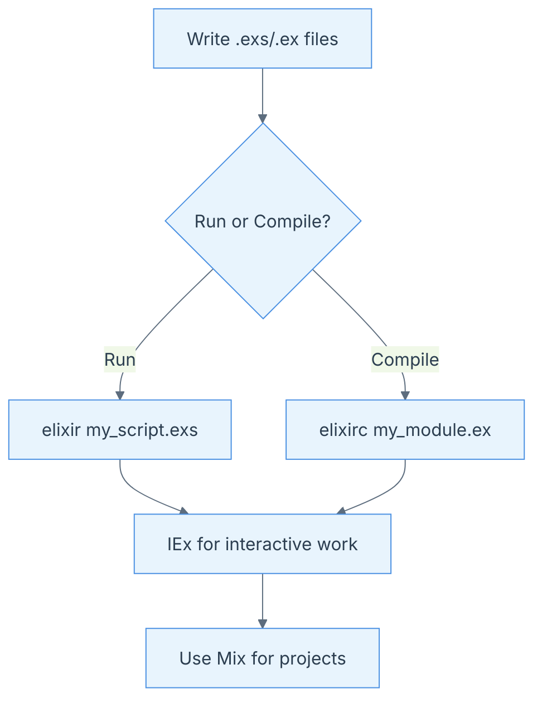

IOiiiiiiiiiiijjjji---
marp: true
title: "Chapter 1: Command Line"
description: "Essential Elixir command-line tools and techniques"
theme: default
paginate: true
---

<!-- _cover: true -->

# Chapter 1: Command Line

- 🚀 Essential tools for Elixir developers
- Run scripts, use IEx, compile, and manage projects
- Boost productivity from the terminal

---

## Running Elixir Scripts

- Save code in `.exs` files
- Run with:
	```sh
	elixir my_script.exs
	```
- Output is printed to terminal

---

### Example

```elixir
IO.puts("Hello, Elixir!")
```

```sh
elixir hello.exs
```

_Output:_
```
Hello, Elixir!
```

---

## Interactive Elixir (IEx)

- Start with:
	```sh
	iex
	```
- Evaluate code interactively
- Explore modules and test ideas

---

### IEx Example

```elixir
iex> 1 + 2
3
iex> String.upcase("elixir")
"ELIXIR"
```

---

## Running Scripts in IEx

- Load a script:
	```elixir
	iex> c("my_script.exs")
	```
- Or start IEx with a script:
	```sh
	iex my_script.exs
	```
- Access script context interactively

---

## Command-Line Arguments

- Access with `System.argv/0`
- Example:
	```elixir
	IO.inspect(System.argv())
	```
- Run with arguments:
	```sh
	elixir my_script.exs foo bar
	```
	_Output:_
	```
	["foo", "bar"]
	```

---

## Compiling Elixir Files

- Compile to `.beam` bytecode:
	```sh
	elixirc my_module.ex
	```
- Output: `Elixir.MyModule.beam` (current dir or `_build/`)

---

## Running Code from the Command Line

- Use `-e` for quick snippets:
	```sh
	elixir -e "IO.puts(1 + 2)"
	```
	_Output:_
	```
	3
	```

---

## Using Mix

- Elixir’s build tool 🛠️
- Create projects, manage deps, run tests

---

### Creating a New Project

```sh
mix new my_app
```
- Generates project structure

---

### Running Tests

```sh
mix test
```
- Runs all tests in the project

---

## Getting Help

- Most commands support `--help`:
	```sh
	elixir --help
	iex --help
	mix --help
	```
- Shows usage and options

---

## Elixir Command-Line Workflow



---

# 🎉 Ready to Explore!

- You now know the basics of Elixir’s command-line tools
- Experiment, build, and automate with confidence!
