<!--
_class: lead
-->
# Chapter 1: Command Line

---

## Introduction

- Command line is the main interface for Elixir development
- IEx: Interactive Elixir shell for prototyping and testing
- Mix: Build tool for project management

---

## IEx Basics

- Start with `iex`
- Evaluate expressions instantly
- Define modules and functions interactively
- Access documentation with `h` helper

---

## Mix Tool

- Create new projects: `mix new <app_name>`
- Manage dependencies
- Compile and run applications
- Generate supervised and umbrella apps

---

## Using Erlang from Elixir

- Elixir runs on the Erlang VM
- Call Erlang modules/functions directly (e.g., `:lists.last([1,2,3])`)
- Leverage the Erlang ecosystem

---

## Inspecting the System

- Use `:application.which_applications` to list running apps
- `:erlang.memory` for memory stats
- Observer GUI: `:observer.start`

---

## Custom Mix Tasks

- Define tasks in `Mix.Tasks` namespace
- Use `run/1` as entry point
- Example: Print VM memory usage

---

## Key Takeaways

- IEx and Mix are essential for Elixir development
- Command line enables rapid prototyping and project management
- Deep integration with Erlang ecosystem

---

## Diagram: Command Line Workflow

```mermaid
%%{init: {
  'theme':'base',
  'themeVariables': {
    'primaryColor':'#E8F4FD',
    'primaryBorderColor':'#4A90E2',
    'primaryTextColor':'#2C3E50',
    'secondaryColor':'#F0F8E8',
    'tertiaryColor':'#FDF2E8',
    'quaternaryColor':'#F8E8F8',
    'lineColor':'#5D6D7E',
    'fontFamily':'Inter,Segoe UI,Arial'
  }
}}%%
graph TD
  A[IEx Shell 🖥️] --> B[Prototype Code]
  B --> C[Mix Tool 🛠️]
  C --> D[Project Creation]
  C --> E[Dependency Management]
  C --> F[Custom Tasks]
  A --> G[Access Docs 📚]
  A --> H[Call Erlang Modules 🧬]
  A --> I[System Inspection 🔍]
```

---

## Thank you! 🎉
